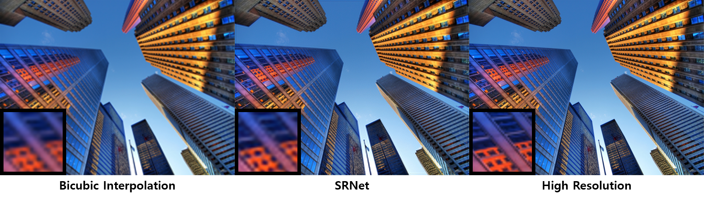

Super-Resolution Network
=====

Implementation of Image Super-Resolution using Deep Convolutional Network.  

Architecture
-----
  
Figure 1. The architecture of the Super-Resolution Network (SRNet).  
   
The architecture constructed by three convolutional layers, and the kernel size are 9x9, 1x1, 3x2 respectively. It used RMS loss and stochastic gradient descent opeimizer for training in this repository, but original one was trained by MSE loss (using same optimizer). The input of the SRNet is Low-Resolution (Bicubic Interpolated) image that same size of the output image, and the output is High-Resolution.  

Results
-----
  
Figure 2. Reconstructed image in each iteration.  
   

  
Figure 3. Comparison between the input (Bicubic Interpolated), reconstructed image (by SRNet) and output (High-Resolution) image.  
   

Reference
-----
[1] Image Super-Resolution Using Deep Convolutional Networks, Chao Dong et al., https://ieeexplore.ieee.org/abstract/document/7115171/  
[2] Urban 100 dataset, Huang et al.,  https://sites.google.com/site/jbhuang0604/publications/struct_sr  
